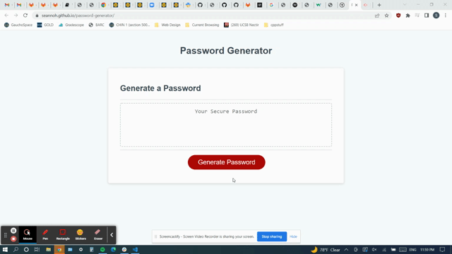

# Password Generator

## Description

A web application to randomly generate a password based on certain criteria (length and character type to inclue) inputted by the user. The starter code for the HTML and CSS was provided by Berkeley Coding Bootcamp. I provided the logic for the app using pure Javascript.

## Installation

Upload all files or fork from the repository to your server. The website linked below is deployed using Github Pages.

## Usage

Click the "Generate Password" button to begin. Follow the series of prompts to input criteria. The generated password will appear in the textbox.

### Links

- [Website](https://seannoh.github.io/password-generator/)
- [Repository](https://github.com/seannoh/password-generator)

## Preview

## References Used

- https://developer.mozilla.org/en-US/docs/Web/API/Window/prompt
- https://developer.mozilla.org/en-US/docs/Web/JavaScript/Reference/Global_Objects/Math/random
- https://bost.ocks.org/mike/shuffle/compare.html

## License

MIT License

Copyright (c) 2022 seannoh

Permission is hereby granted, free of charge, to any person obtaining a copy
of this software and associated documentation files (the "Software"), to deal
in the Software without restriction, including without limitation the rights
to use, copy, modify, merge, publish, distribute, sublicense, and/or sell
copies of the Software, and to permit persons to whom the Software is
furnished to do so, subject to the following conditions:

The above copyright notice and this permission notice shall be included in all
copies or substantial portions of the Software.

THE SOFTWARE IS PROVIDED "AS IS", WITHOUT WARRANTY OF ANY KIND, EXPRESS OR
IMPLIED, INCLUDING BUT NOT LIMITED TO THE WARRANTIES OF MERCHANTABILITY,
FITNESS FOR A PARTICULAR PURPOSE AND NONINFRINGEMENT. IN NO EVENT SHALL THE
AUTHORS OR COPYRIGHT HOLDERS BE LIABLE FOR ANY CLAIM, DAMAGES OR OTHER
LIABILITY, WHETHER IN AN ACTION OF CONTRACT, TORT OR OTHERWISE, ARISING FROM,
OUT OF OR IN CONNECTION WITH THE SOFTWARE OR THE USE OR OTHER DEALINGS IN THE
SOFTWARE.
